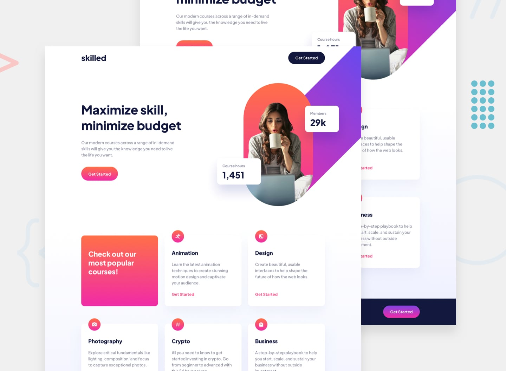

# Frontend Mentor - Skilled e-learning landing page

     

Projeto feito para treinar os fundamentos de HTML e CSS, além da responsividade. Também decidi usar SCSS por opção para treinar ainda mais os conceitos dessa linguagem.

## Tecnologias utilizadas
   

## Acesso ao projeto
- Link da solução.
- Site no ar.

## Abrir e rodar o projeto
1. Clone este repositório em sua máquina local ou baixe os arquivos clicando [aqui](https://github.com/caioikn/skilled/archive/main/skilled.zip).
2. Abra o arquivo `index.html` em um navegador da web.

---
**Desenvolvido por [Caio](https://www.linkedin.com/in/caioikena/)** 💙
